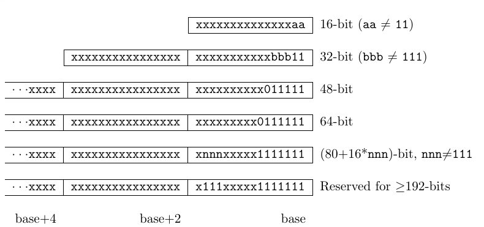
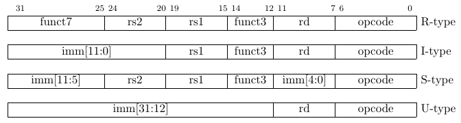
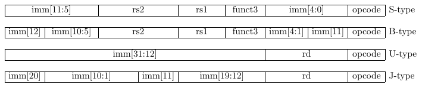
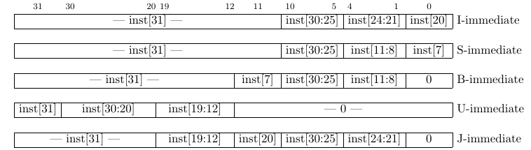
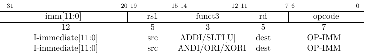
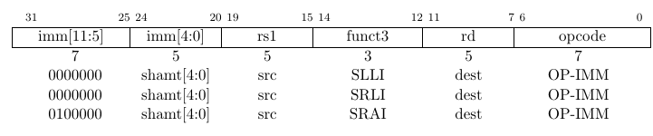
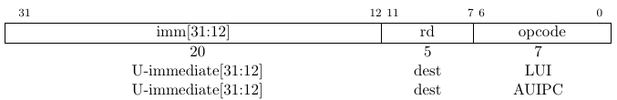
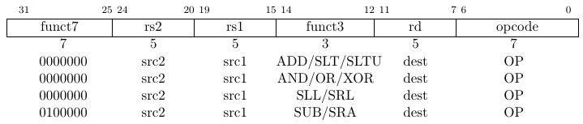
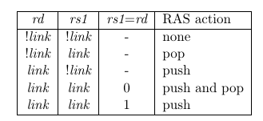

# RISC-V ISA note
## 1. Introduction 
### Instruction Length Encoding
All the 32-bit
instructions in the base ISA have their lowest two bits set to 11. The optional compressed 16-bit
instruction-set extensions have their lowest two bits equal to 00, 01, or 10. Standard instruction-set extensions encoded with more than 32 bits have additional low-order bits set to 1.



- An implementation of the standard G(“IMAFD”) ISA need only hold the most-significant 30 bits(for 32-bit fix length inst) in instruction caches (a 6.25% saving).
- By condensing the base ISA into a subset of the 32-bit instruction word, we leave more space available for custom extensions. In particular, the base RV32I
ISA uses less than 1/8 of the encoding space in the 32-bit instruction word. An custom implementation that does not require support for the standard compressed instruction extension can map 3 additional 30-bit instruction spaces into the 32-bit fixed-width format
- Consider it a feature that any length of instruction containing all zero bits is not legal, as this quickly traps erroneous jumps into zeroed memory regions. Similarly, we also reserve the
instruction encoding containing all ones to be an illegal instruction, to catch the other common
pattern observed with unprogrammed non-volatile memory devices, disconnected memory buses,
or broken memory devices.
- The base RISC-V ISA has a little-endian memory system, but non-standard variants can provide a
big-endian or bi-endian memory system. In order to implement endianness independent, Instructions are stored in memory with each 16-bit parcel stored in a memory halfword according to the implementation's natural endianness. Parcels forming
one instruction are stored at increasing halfword addresses, with the lowest addressed parcel holding
the lowest numbered bits in the instruction specification, i.e., instructions are always stored in a little-endian sequence of parcels regardless of the memory system endianness.

```
// Store  32-bit instruction in x2 register to location pointed to by x3.
sh x2, 0(x3) 	// Store low bits of instruction in first parcel.
srli x2, x2, 16 // Move high bits down to low bits, overwriting x2.
sh x2, 2(x3) 	// Store high bits in second parcel.
```

*We have to fix the order in which instruction parcels are stored in memory, independent
of memory system endianness, to ensure that the length-encoding bits always appear first in halfword address order. This allows the length of a variable-length instruction to be quickly
determined by an instruction fetch unit by examining only the first few bits of the first 16-bit
instruction parcel. Once we had decided to fix on a little-endian memory system and instruction
parcel ordering, this naturally led to placing the length-encoding bits in the LSB positions of the
instruction format to avoid breaking up opcode fields*

### Exceptions, Traps, and Interrupts
- exception: an unusual condition occurring at run time associated with an instruction in the current RISC-V thread
- trap: We use the term trap to refer to the synchronous transfer of control to a trap handler caused by an exceptional condition occurring within a RISC-V thread. (*Trap handlers usually execute in a more privileged environment*)
- interrupt: an external event that occurs synchronously to the current RISC-V thread. (*When an interrupt that must be serviced occurs, some instruction is selected to receive an interrupt exception and subsequently experiences a trap*)
- the expectation is that most environments will take a precise trap when an exception is signaled (except for floating-point exceptions, which, in the standard floating-point extensions, do not cause traps).
 
## 2. RV32I Base Integer Instruction Set (Version 2.0)

### property
- The ISA was also designed to reduce the hardware required in a minimal implementation
- contains 47 unique instructions and can be reduced to 38 total.
- can emulate almost any other ISA extension (except the A extension, which requires additional hardware support for atomicity).

### user-visible register
- There are 31 general-purpose registers x1-x31
- x0 is hardwired to the constant 0.
- There is no hardwired subroutine return address on a call, but the standard software calling convention uses register x1 to hold the return address on a call.
- the program counter pc holds the address of the current instruction

### Base Instruction Formats
In the base ISA, there are four core instruction formats (R/I/S/U)



**what is nice concern of the format**

-  keeps the source (rs1 and rs2) and destination (rd) registers at the same position in all formats to simplify decoding (Except for the 5-bit immediates used in CSR instructions
).
-  immediates are always sign-extended, and are generally packed towards the leftmost
available bits in the instruction and have been allocated to reduce hardware complexity. In partic-
ular, the sign bit for all immediates is always in bit 31 of the instruction to speed sign-extension
circuitry.

*Decoding register specifiers is usually on the critical paths in implementations*

*In practice, most immediates are either small or require all XLEN bits. We chose an asymmetric immediate split (12 bits in regular instructions plus a special load upper immediate in-struction with 20 bits) to increase the opcode space available for regular instructions.*

### Immediate Encoding Variants
There are a further two variants of the instruction formats (B/J) based on the handling of immediates



the 12-bit immediate field is used to encode
branch offsets in multiples of 2 in the B format. Instead of shifting all bits in the instruction-encoded immediate left by one in hardware as is conventionally done, the middle bits (imm[10:1]) and sign bit stay in fixed positions, while the lowest bit in S format (inst[7]) encodes a high-order bit in B format.

the purpose of immediate position design is to maximize overlap with the other formats and with each other.



*Sign-extension is one of the most critical operations on immediates (particularly in RV64I), and in RISC-V the sign bit for all immediates is always held in bit 31 of the instruction to allow
sign-extension to proceed in parallel with instruction decoding.*

### Integer Computational Instructions
Integer computational instructions are either encoded as register-immediate operations using
the I-type format or as register-register operations using the R-type format.

- The destination is register rd for both register-immediate and register-register instructions
- No integer computational instructions cause arithmetic exceptions.

*why no need overflow checking for ISA?*

because as many overflow checks can be cheaply implemented using RISC-V branches. 

- Overflow checking for unsigned addition requires only a single additional branch instruction after the addition: 

```
add t0, t1, t2
bltu t0, t1, overflow
```
- For signed addition, if one operand’s sign is known, overflow checking requires only a single
branch after the addition such as 

```
addi t0, t1, +imm
blt t0, t1, overflow

```
- For general signed addition, three additional instructions after the addition are required,
leveraging the observation that the sum should be less than one of the operands if and only if the
other operand is negative.

```
add t0, t1, t2
slti t3, t2, 0
slt t4, t0, t1
bne t3, t4, overflow
```

*In RV64, checks of 32-bit signed additions can be optimized further by comparing the results of
ADD and ADDW on the operands.*

#### Interger Register-Immediate Instructions
- ADDI: adds the sign-extended 12-bit immediate to register rs1

*ADDI rd, rs1, 0 is used to implement the MV
rd, rs1 assembler pseudo-instruction*
- SLTI[U]:  (set less than immediate) places the value 1 in register rd if register rs1 is less than the sign-extended immediate when both are treated as signed numbers, else 0 is written to rd. SLTIU is similar but compares the values as unsigned numbers (i.e., the immediate is first sign-extended to XLEN bits then treated as an unsigned number)

*SLTIU rd, rs1, 1 sets rd to 1 if rs1 equals
zero, otherwise sets rd to 0 (assembler pseudo-op SEQZ rd, rs).*

- ANDI/ ORI/ XORT

*XORI rd, rs1, -1 performs
a bitwise logical inversion of register rs1 (assembler pseudo-instruction NOT rd, rs).*

- SLLI/ SRLI/ SRAI: Shifts by a constant are encoded as a specialization of the I-type format. The operand to be shifted is in rs1, and the shift amount is encoded in the lower 5 bits of the I-immediate field.

- LUI: (load upper immediate) is used to build 32-bit constants and uses the U-type format. LUI
places the U-immediate value in the top 20 bits of the destination register rd, filling in the lowest
12 bits with zeros

- AUIPC: (add upper immediate to pc) is used to build pc-relative addresses and uses the U-type
format. AUIPC forms a 32-bit offset from the 20-bit U-immediate, filling in the lowest 12 bits with zeros, adds this offset to the pc, then places the result in register rd.

*The AUIPC instruction supports two-instruction sequences to access arbitrary offsets from the
PC for both control-flow transfers and data accesses. The combination of an AUIPC and the
12-bit immediate in a JALR can transfer control to any 32-bit PC-relative address, while an
AUIPC plus the 12-bit immediate offset in regular load or store instructions can access any
32-bit PC-relative data address.
The current PC can be obtained by setting the U-immediate to 0. Although a JAL +4
instruction could also be used to obtain the PC, it might cause pipeline breaks in simpler mi-
croarchitectures or pollute the BTB structures in more complex microarchitectures.*

#### Integer Register-Register Operations
- ADD/ SUB
- SLT/ SLTU: writing 1 to rd if rs1 < rs2, 0 otherwise

*SLTU rd, x0, rs2 sets rd to 1
if rs2 is not equal to zero, otherwise sets rd to zero (assembler pseudo-op SNEZ rd, rs)*
- AND/ OR/ XOR
- SLL/ SRL/ SRA: perform logical left, logical right, and arithmetic right shifts on the value in
register rs1 by the shift amount held in the lower 5 bits of register rs2
- NOP: does not change any user-visible state, except for advancing the pc. NOP is
encoded as ADDI x0, x0, 0.

*NOPs can be used to align code segments to microarchitecturally significant address boundaries,
or to leave space for inline code modifications. Although there are many possible ways to encode
a NOP, we define a canonical NOP encoding to allow microarchitectural optimizations as well
as for more readable disassembly output.*






21 inst total
### Control Transfer Instructions
two types of control transfer instructions: unconditional jumps and conditional
branches. Control transfer instructions in RV32I do not have architecturally visible delay slots.

#### Uconditional Jumps
- JAL: ("direct" jump and link) uses the J-type format, where the J-immediate **encodes a signed offset in multiples of 2 bytes**. The offset is sign-extended and added to the pc to form the jump target address. Jumps can therefore target a ±1 MiB range. JAL stores the address of the
instruction following the jump (pc+4) into register rd. The standard software calling convention uses x1 as the return address register and x5 as an alternate link register.

*The alternate link register supports calling millicode routines (e.g., those to save and restore
registers in compressed code) while preserving the regular return address register. The register
x5 was chosen as the alternate link register as it maps to a temporary in the standard calling
convention, and has an encoding that is only one bit different than the regular link register.*

*Plain unconditional jumps (assembler pseudo-op J) are encoded as a JAL with rd=x0.*

- JALR: ("indirect" jump and link register) uses the I-type encoding.  The target address is obtained by adding the 12-bit signed I-immediate to the register rs1, then setting the least-significant bit of the result to zero. The address of the instruction following the jump (pc+4) is written to register rd. Register x0 can be used as the destination if the result is not required

*The unconditional jump instructions all use PC-relative addressing to help support position-
independent code.*

*The JALR instruction was defined to enable a two-instruction sequence to
jump anywhere in a 32-bit absolute address range. A LUI instruction can first load rs1 with the
upper 20 bits of a target address, then JALR can add in the lower bits. Similarly, AUIPC then
JALR can jump anywhere in a 32-bit pc-relative address range*

**note that the JALR instruction does not treat the 12-bit immediate as multiples of 2 bytes**
This avoids one more immediate format in hardware.
In practice, most uses of JALR will have either a zero immediate or be paired with a LUI or
AUIPC, so the slight reduction in range is not significant.

*The JALR instruction ignores the lowest bit of the calculated target address. This both
simplifies the hardware slightly and allows the low bit of function pointers to be used to store
auxiliary information. Although there is potentially a slight loss of error checking in this case,in practice jumps to an incorrect instruction address will usually quickly raise an exception.*

*When used with a base rs1=x0, JALR can be used to implement a single instruction sub-
routine call to the lowest 2 KiB or highest 2 KiB address region from anywhere in the address
space, which could be used to implement fast calls to a small runtime library.*

The JAL and JALR instructions will generate a misaligned instruction fetch exception if the target address is not aligned to a four-byte boundary.

*Instruction fetch misaligned exceptions are not possible on machines that support extensions
with 16-bit aligned instructions, such as the compressed instruction set extension, C.*

Return-address prediction stacks are a common feature of high-performance instruction-fetch units, but require accurate detection of instructions used for procedure calls and returns to be effective. For RISC-V, hints as to the instructions’ usage are encoded implicitly via the register numbers used. A JAL instruction should push the return address onto a return-address stack (RAS) only when rd=x1/x5. JALR instructions should push/pop a RAS: 


 
 **In the above, link is true when the register is either x1 or x5**

*Some other ISAs added explicit hint bits to their indirect-jump instructions to guide return-
address stack manipulation. We use implicit hinting tied to register numbers and the calling
convention to reduce the encoding space used for these hints.*

When two different link registers (x1 and x5) are given as rs1 and rd, then the RAS is both pushed and popped to support coroutines. If rs1 and rd are the same link register (either x1 or x5), the RAS is only pushed to enable macro-op fusion of the sequences:
```
lui ra, imm20
jalr ra, ra, imm12
```
and 
```
auipc ra, imm20
jalr ra, ra, imm12
```
#### Conditional Branches
All branch instructions use the B-type instruction format. The 12-bit B-immediate encodes signed
offsets in multiples of 2, and is added to the current pc to give the target address. The conditional
branch range is ±4 KiB

- BEQ/ BNE/ BLT/ BLTU/ BGE/ BGEU

*Signed array bounds may be checked with a single BLTU instruction, since any negative index
will compare greater than any nonnegative bound.*

Software should be optimized such that the sequential code path is the most common path, with
less-frequently taken code paths placed out of line. Software should also assume that backward
branches will be predicted taken and forward branches as not taken, at least the first time they are encountered. Dynamic predictors should quickly learn any predictable branch behavior.


Software should be optimized such that the sequential code path is the most common path, with
less-frequently taken code paths placed out of line. Software should also assume that backward
branches will be predicted taken and forward branches as not taken, at least the first time they are
encountered. Dynamic predictors should quickly learn any predictable branch behavior.

The conditional branches were designed to include arithmetic comparison operations between
two registers

** motivation**

- combined compare-and-branch instruction fits into a regular pipeline, avoids additional condition code state or use of a temporary register, and reduces static code size and dynamic instruction fetch traffic

- comparisons against zero require non-trivial circuit delay (especially after the move to static logic in advanced processes) and so are almost as expensive as arithmetic magnitude compares.
-  Another advantage of a fused compare-and-branch instruction
is that branches are observed earlier in the front-end instruction stream, and so can be predicted earlier.
- 

### Load and Store Instructions

### Memory Model

### Control and Status Register Instructions

### Environment Call and Breakpoints
