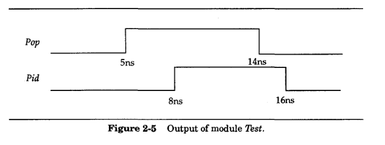
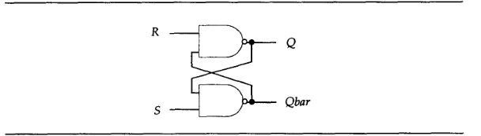

# verilog reading note

## J. Bhasker - A Verilog HDL Primer (1998, Star Galaxy Publisher)
### verilog
The language not only defines the syntax but also defines very clearsimulation semantics for each language construct. Therefore, models written inthis language can be verified using a Verilog simulator.

### history
- 1983 The Verilog HDL language was first developed by Gateway Design Automation as a hardware modeling language for their simulator product
- 1990 In an effort to increase the popularity of the language, the language was placed in the public domain in 1990. And Open Verilog International(OVI) was formed to promote Verilog.
- 1992 OVI decided to pursue standardization of Verilog HDL as an IEEE standard.
- 1995 The effort was successful and the language became an IEEE standard and was updated in 2001 and 2005

**Notice that the standard of the book is 1995**

### capabilities
- A design can be modeled in three different styles or in a mixedstyle. These styles are: behavioral style - modeled using procedural constructs; dataflow style - modeled using continuous assignments; and structural style - modeled using gate and moduleinstantiations.
- There are two data types in Verilog HDL; the net data type andthe register data type. The net type represents a physical connection between structural elements while a register type representsan abstract data storage element.
- **Q**--The capabilities of the Verilog HDL language can be further extended by using the programming language interface (PLI) mechanism. PLI is a collection of routines that allow foreign functions to access information within a Verilog module and allows for designer interaction with the simulator.
- A design can be described in a wide range of levels, ranging fromswitch-level, gate-level, register-transfer-level (RTL) toalgorithmic-level, including process and queuing-level.
- support mixed level modeling
- High-level programming language constructs such as conditionals, case statements, and loops are available in the language.
- sometimes non-deterministic

### Tutorial
- dataflow behavior of a design is described usingcontinuous assignments
- sequential behavior is described using proceduralconstructs.
- the statements are concurrent

`timescale 1ns / 100ps which says that one time unit is to be treated as 1ns and tht the time precision is to be 100ps (the time precision says that all delays must be rounded to 0.1ns)

#### Describing in Dataflow Style
assign [ delay ] LHS_net = RHS_expression;

The basic mechanism used to model a design in the dataflow style is thecontinuous assignment. In a continuous assignment, a value is assigned to a net.

**Notice that the continuous assignments model dataflow behavior of thecircuit; the structure is implicit, not explicit. In addition, continuousassignments execute concurrently, that is, they are order-independent.**

#### Describing in Behavioral Style
The behavior of a design is described using procedural constructs. These are:

- Initial statement: This statement executes only once.
- Always statement: This statement always executes in a loop, thatis, the statement is executed repeatedly.

**Only a register data type can be assigned a value in either of these statements.Such a data type retains its value until a new value is assigned. All initialstatements and always statements begin execution at time 0 concurrently.**

use the following code to explain
```
module FA_Seq {A, B, Cin, Sum, Cout)input A, B, Cin;
	output Sum, Cout;
	reg Sum, Cout;
	reg Tl, T2, T3;
	always@ (A or B or Cin) begin
		Sum = (A ^ B) ^ Cin;
		Tl = A & Cin;
		T2 = B & Cin;
		T3 = A & B;
		Cout = (Tl | T2) | T3;
	end
endmodule
```
explain:
The module FA_Seq has three inputs and two outputs. Sum, Cout, Tl, T2 and T3 are declared to be of type reg (reg is one of the register data types) because these are assigned values within the always statement. The always statement has a sequential block (begin-end pair) associated with an event control (the expression following the @ character). This means that whenever an event occurs on A, B or Cin, the sequential block is executed. Statements within a sequential block execute sequentially and the execution suspends after the last statement in the sequential block has executed. After the sequential block completes execution, the always statement again waits for an event to occuron A, B, or Cin.

**The statements that appear within the sequential block are examples of blocking procedural assignments. A blocking procedural assignment completes execution before the next statement executes. A procedural assignment may optionally have a delay.**

Delays can be specified in two different forms:
- Inter-statement delay: This is the delay by which a statement's execution is delayed.
```
Sum = (A ^ B) ^ Cin;
#4 Tl = A & Cin;
```
- Intra-statement delay: This is the delay between computing the value of the right-hand side expression and its assignment to theleft-hand side.
```
Sum = #3 (A ^ B) ^ Cin;
```

Here is a vivid example of initial statement and the behavior of **simulation**
```
`timescale 1ns / 1ns // which means must be integer delay
module Test {Pop, Pid);
	output Pop, Pid;
	reg Pop, Pid;
	initial begin
		Pop = 0; // Stmt 1
		Pid = 0; // stmt 2
		Pop = #5 1;
		Pid = #3 1;
		Pop = #6 0;
		Pid = #2 0;
	end
endmodule
```


#### Describing in Structural Style
Structure can be described in Verilog HDL using:
- Built-in gate primitives (at the gate-level)
- Switch-level primitives (at the transistor-level)
- User-defined primitives (at the gate-level)
- Module instances (to create hierarchy)

#### Simulating a Design
Stimulus and control can be generated using initial statements. Responses from the design under test can be saved as "save on change" or as strobed data. Finally, verification can be performed by automatically comparing with expected responses by writing appropriate statements in an initial statement.
```
`timescale 1ns/1ns
module Top; // A module may have an empty port list.
	reg PA, PB, PCi;
	wire PCo, PSum;
	// Instantiate module under test:
	FA_Seq Fl (PA, PB, PCi, PSum, PCo); // Positional.
	initial begin: ONLY_ONCE
		reg [3:0] Pal; // Need 4 bits so that Pal can have the value 8.
		for (Pal = 0; Pal < 8; Pal = Pal + 1) begin
			{PA, PB, PCi) = Pal;
			#5 $display ("PA, PB, PCi=%b%b%b", PA, PB, PCi," 
				::: PCo, PSum=%b%b", PCo, PSum);
		end
	end
endmodule
```
 The $display system task prints the specified argument values in thespecified format to the output.

 The delay control in the $display system task call specifies that the $dis-play task is to be executed after 5 time units. This 5 time units basically repre sents the settling time for the logic, that is, the delay time between theapplication of a vector and observing the module-under-test's response.
 ** Pal is declared locally withinthe initial statement. To do this, the sequential block (begin-end) in the initialstatement has to be labeled. ONLY_ONCE is the block label in this case. The block label is not necessary if there are no variables declared locally within the block.**

 **In a module instantiation, the ports can be associated by name or by position.**

here is another vivid example


```
`timescale 10ns/1ns
module RS_FF (Q, Qbar, R, S);
	output Q, Qbar;
	input R, 5;
	nand #1 (Q, R, Qbar);
	nand #1 (Qbar, S, Q); // Instance names are optional in gate instantiations.
endmodule

module Test;
	reg TS, TR;
	wire TQ, TQb; // Instantiate module under test:
	RS_FF NSTA (.Q(TQ) , .S(TS) , .R(TR) , .Qbar(TQb));// Using named association.
	// Apply stimulus:
	initial begin
		TR = 0;
		TS = 0;
		#5 TS = 1;
		#5 TS = 0;
		TR = 1;
		#5 TS = 1;
		TR = 0;
		#5 TS= 0;
		#5 TR = 1;
	end
	// Display output:
	initial
		$monitor ("At time %t, " $time,
		" TR=%b, TS=%b, TQ=%b, TQb=%b", TR, TS, TQ, TQb)
endmodule
```
**The second initial statement is used to call the system task Smonitor. This task when called causes the specified string to be printed whenever a change occurs in the specified variables in the argument list.**

### language 
#### improve readability
- The ? character can be used as an alternate for value z in a number. It maybe used to improve readability in cases where the value z is interpreted as a don't care value

- An underscore (_) character can be used in an integer or a real constantfreely; they are ignored in the number itself. only restriction is that the underscore character cannot be the firstcharacter.

#### Base Format Notation
```
[ size ] 'base value
```
**A number in base format notation is always an unsigned number. The sizespecification is optional in an integer of this form. If no size is specified in aninteger, the size of the number is the number of bits specified in the value.**

#### Data type
- Net type:

A net typo, represents a physical connection between structural elements. Its value is determined from the value of its drivers suchas a continuous assignment or a gate output. If no driver is connected to a net, the net defaults to a value of z.

- Register type:
A register type represents an abstract data storage element. It isassigned values only within an always statement or an initialstatement, and its value is saved from one assignment to the next.A register type has a default value of x.

#### vectored and scalared nets
The keywords, scalared or vectored, can optionally be specified for avector net. If a net is declared with the keyword vectored, then bit-selects andpart-selects of this vector net are not allowed; in other words, the entire nethas to be assigned 